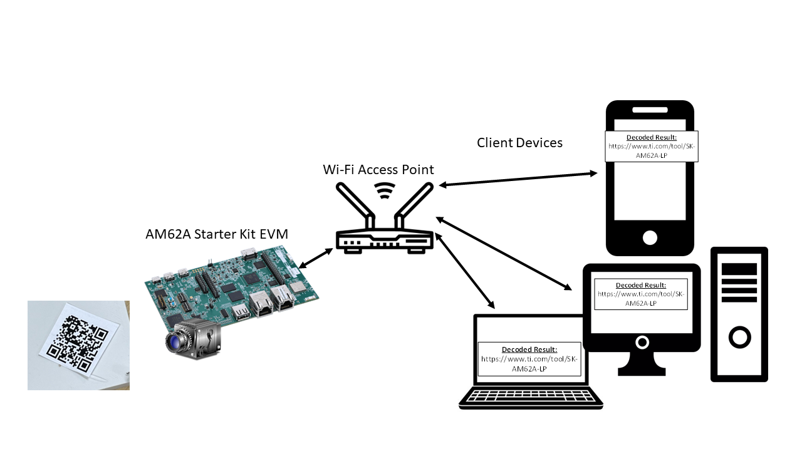
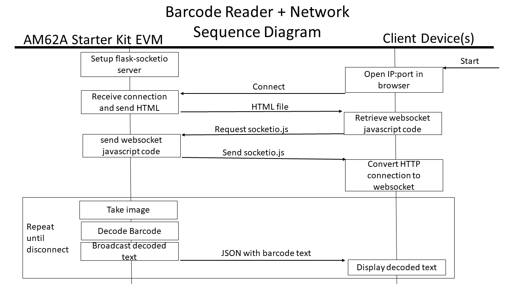

# Wifi Attach

Note: until CC33x drivers are upstream and available, please go through your TI field representative to get access to kernel patches to enable AM62A with CC33x over SDIO or SPI

## Barcode Reader with WiFi

Handheld barcode readers offer convenience and utility in many applications with inventory management, retail, and other applications where workers or customers need to use the barcode reader flexibly. These are more power and size constrained. 

This original barcode reader demo is augmented by adding a wifi interface that is used for sending decoded barcode information to other devices on the same network. From the application perspective, wifi looks like any other network interface in Linux, and is not treated any differently once enabled on the device.

The Starter Kit EVM for the AM62A has an M.2 interface with SDIO that the CC33x development board can be connected to for evaluation. This document will provide some information on enabling this card through SDIO with the device tree, but linux patches for drivers are not available here for IP reasons at this time.

The image below depicts the simplified network setup. The EVM connects to the wifi router through station mode, and is granted an IP address. Other devices on the same network can see this device. Wifi can be substituted with other network interfaces




## Setup AM62A with Wi-Fi

To enable Wi-Fi with the CC33x M.2 device over SDIO, there are two primary components. 
  * Build and install the kernel module for the CC33x driver
  * Modify the device tree to activate the SDIO interface and other hardware-level signals 

### Building and installing the kernel modules

  1. Install the [processor SDK](https://www.ti.com/tool/PROCESSOR-SDK-AM62A) for Linux
  2. Follow the guide to do the first build for the majority of the kernel
      a. This requires making the .config wiht a command like 'make tisdk_am62axx-evm_defconfig' with the proper environment variables (e.g. CROSS_COMPILE, ARCH)
  3. Assuming CC33x drivers are not upstream, apply those as directed by field representative or TI's connectivity support team
  4. [Compile the Image](https://software-dl.ti.com/processor-sdk-linux/esd/AM62AX/latest/exports/docs/linux/Foundational_Components_Kernel_Users_Guide.html#compiling-the-kernel)
  5. [Compile the modules](https://software-dl.ti.com/processor-sdk-linux/esd/AM62AX/latest/exports/docs/linux/Foundational_Components_Kernel_Users_Guide.html#compiling-the-kernel-modules)
  6. Depending on which silicon is being used (GP vs. HS-FS), sign the binaries according to SDK documentation. This is only necessary on HS-FS silicon
  7. Flash an SD card with the edgeai-sdk wic image for the AM62A. Take note of the location in the filesystem for the boot and root partitions
  8. Install the image and kernel modules to the rootfs

### Modifying the device tree to enable CC33x

For this, we'll need to modify the device tree, compile within the linux kernel, and update the compiled device tree in the /boot directory of the root partition. 

  1. Go into the linux kernel within the SDK and patch using the [am62a-cc33x-dts.patch](../wifi/am62a-cc33x-dts.patch) file
    a. This applies to the commit: efb15dc76324315ec72d59b31b4100da9b2fac92 (HEAD -> processor-sdk-local, ti-linux-5.10.y). This my fail if attempted in another location
    b. run the command from the root of the kernel source directory: "patch -p0 < path_to_this_repo/wifi/am62a-cc33x-dts.patch
  2. [Build the DTS with the linux kernel](https://software-dl.ti.com/processor-sdk-linux/esd/AM62AX/latest/exports/docs/linux/Foundational_Components_Kernel_Users_Guide.html#compiling-the-device-tree-binaries)
    a. It is simple enough to just build all the dtbs since these compile quickly. 
  3. [Install the device tree binaries](https://software-dl.ti.com/processor-sdk-linux/esd/AM62AX/latest/exports/docs/linux/Foundational_Components_Kernel_Users_Guide.html#installing-the-kernel-image-and-device-tree-binaries)
    a. sudo cp arch/arm64/boot/dts/ti/k3-am642-evm.dtb /path_to_rootfs_of_sdcard/boot

### Connecting the EVM with Wi-Fi

**This section is WIP and instructions are highly dependent on the status of the drivers. The goal is to simply obtain a usable IP address over the Wi-Fi interface**

Now, safely eject the SD card, place into the EVM and boot. The kernel message log can be printed with the "dmesg" command. That should show boot messages corresponding to the CC33x. Searching for sdhc and cc33x will be helpful. If the board is not booting through serial, the problem may be related to key-signing for HS-FS silicon or an issue with the Linux image, assuming it was generated. Issues with the device tree will prevent it from booting fully, but there should be prints from u-boot
  * dmesg | grep -i "sdhc"
  * dmesg | grep -i "cc33"

Once CC33x is showing up and present, the next step is setting it up as a linux network interface and connecting to an access point. This can be done from /usr/share/cc33xx.

We'll operate as a station; run the ./sta_start.sh command. Running "ifconfig" should show a wlan0 and wlan1 interface. We'll use wlan0 for station mode, meaning another device like a wi-fi router is acting as the access point.

To connect, we'll use the ./sta_connect.sh script. This needs to be run with the SSID as the first argument, and (if there's security), the security type followed by a password

```
 ./sta_connect-ex.sh my-ssid WPA-PSK my-password1234
```

And once connected, request an IP address for that interface:
```
udhcpc -i wlan0
```

Check ifconfig again (or "ip a") to see if wlan0 was assigned an IP address. A good test is if another device on the network (router included) can be pinged.

## Running the demo

The only additional setup is to install a few python packages:
```
pip3 install flask flask-socketio python-engineio "python-socketio[client]"
```

Most likely, some of the certiicates are not configured on the SDK's default installation, so it may be necessary to add a trusted-host. If behind a firewall, a proxy may also be necessary. HTTP_PROXY and similar variables will also conflict with pip3 and how it uses proxies, so unsetting those environment variables may help as well.

```
pip3 --trusted-host pypi.org --proxy PROXY_IP:PROXY_PORT install [PACKAGES ...]
```

Connect another device to this network to act as a client. From there, launch the application as outlined in the [root-level README](../README.md).

Once the demo is running have another device on the same network connect to the device through the Wi-Fi LAN's IP with port (5001 by default; see [websockets.py](../apps_python/websockets.py)). 

Assuming the network is working correct, a basic HTML page will display, and will have a small line that shows the most recently decoded barcode information.

## How it works

This demo shows a simple example of sending webtraffic as part of a gstreamer application. This proof of concept demo uses a websocket to enable bi-drectional communication between the EVM (acting as a server) and a client. The diagram below shows the setup and steady-state sequence diagrams.



The demo runs the webserver in a separate process from the rest of the gstreamer application. This is forked from the rest of the application before gstreamer itself is launched. 

The thread that runs application code as part of the gstreamer pipeline will also create a client locally before processing any frames to search for barcodes. When barcodes are found, the first barcode found is used to create a message from the local client to the local server. This is used as a form of IPC. The server uses this with socketio to broadcast the decoded text to all connected clients. 

### Remote Clients

Separately, remote clients can connect to the server through the IP address of the AM62A EVM (technically through any network interface that gives IP address, including ethernet if that is available). From their perspective, they attempt to HTTP GET an HTML file to display. Within this HTML, the first step clients must do is request a socketio.js library for setting up a more flexible communication using websockets. This is served locally in case the Wi-Fi network does not have a backhaul to the internet.

Once clients have the websockets javascript, they work with the server on the EVM to upgrade from a TCP+HTTP to WebSocket communication. This allows the barcode reader to push the latest decoding to the clients, instead of relying on them to fetch data as an HTTP connection would require. This connection is reused until the clients disconnect or the application is shut down.

Note that this webserver is not intended for production-grade applications. It shows the flexibility afforded by using WiFi as a network interface, and how the edge AI SDK for Linux can enable more applications.